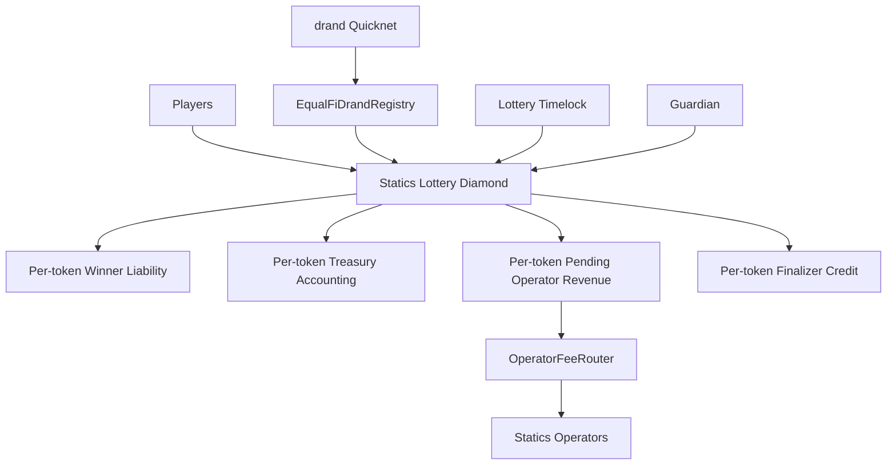
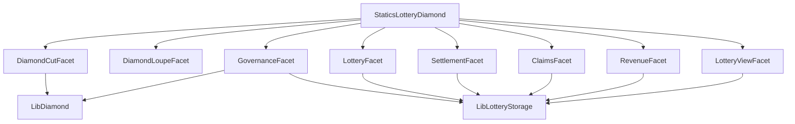
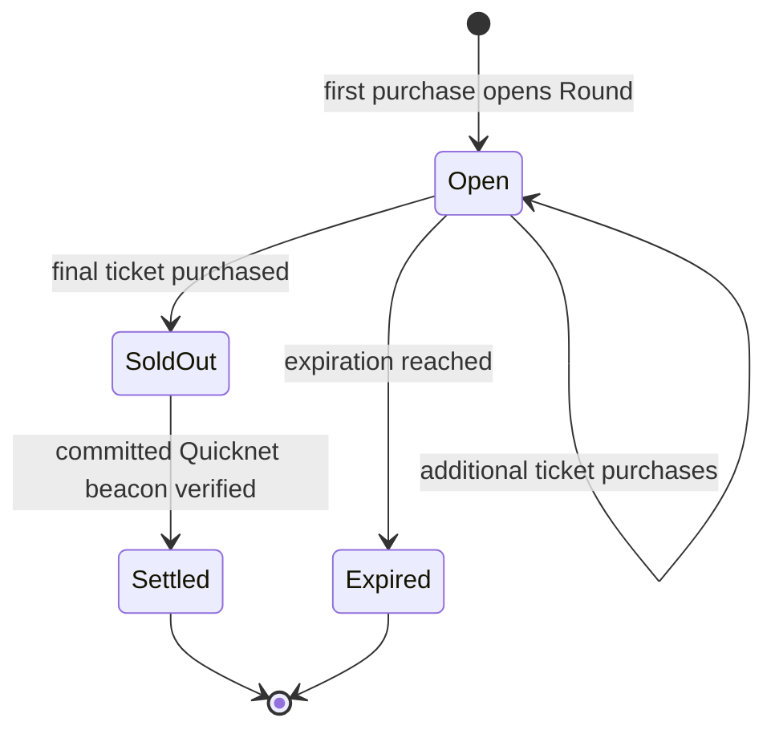
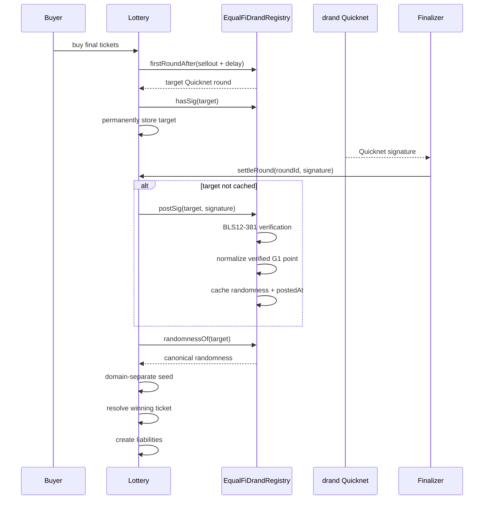
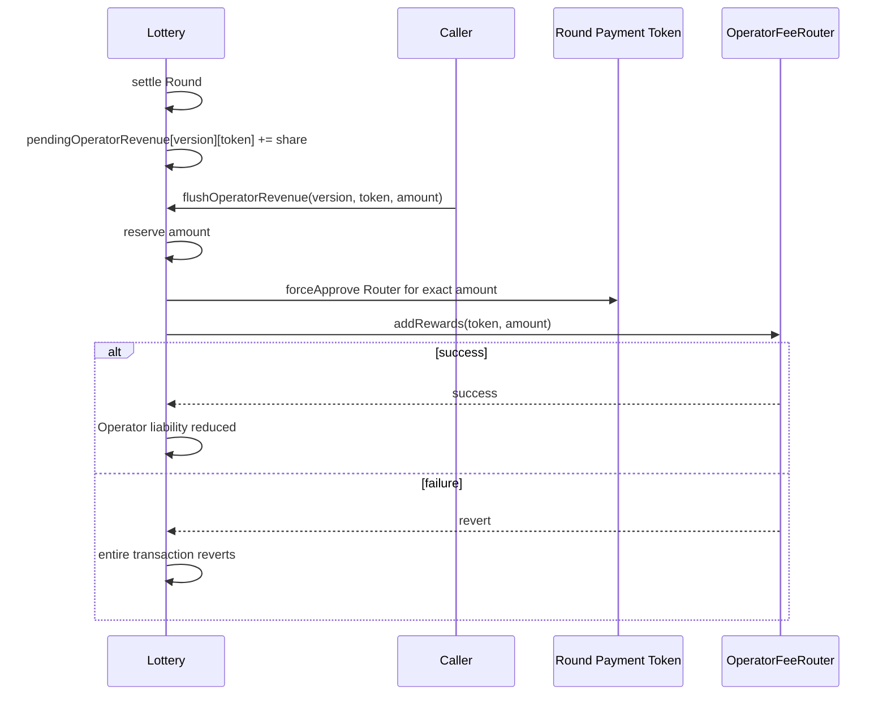

# Design Document: Statics Lottery

## Overview

Statics Lottery is a sellout-based, configurable ERC-20 lottery implemented as an EIP-2535 Diamond.

Players purchase one or more non-transferable ticket positions using the governance-approved Payment Token selected by the Round's immutable configuration version. Multiple concurrent Rounds may use different tokens. Each Round snapshots the complete configuration in effect when the Round begins. When the final ticket sells, the Round permanently commits to a future drand Quicknet round. Once that beacon is available, anyone may settle the Round.

Settlement deterministically divides Round revenue among:

1. the winning ticket holder;
2. Statics Operators;
3. the Statics Treasury; and
4. the finalizer incentive, paid exclusively from the Treasury allocation.

Randomness verification is delegated to a standalone shared `EqualFiDrandRegistry`. Operator reward distribution is delegated to the standalone `OperatorFeeRouter`.

The Lottery does not contain BLS verification logic and does not distribute rewards across individual Operator NFTs.

The Diamond remains upgradeable through timelocked governance during controlled launch. Governance may permanently and irreversibly disable Diamond cuts. Parameter governance remains separate from code upgradeability, meaning configured economic parameters may continue to be changed for future Rounds after the Diamond implementation itself becomes immutable.

### Existing EqualFi Patterns Reused

The Lottery Diamond SHALL adapt the existing Burntato Diamond pattern rather than introduce another proxy model.

Burntato separates Diamond selector storage into a namespaced storage slot and maintains an irreversible `cutsDisabled` state. Its `DiamondCutFacet` rejects cuts after that state is activated.

Burntato's governance implementation exposes `finalizeProtocol()`, which permanently sets the cut-disabled state while leaving ordinary protocol configuration logic separate.

Burntato also isolates protocol domains into deterministic namespaced storage slots rather than relying on a single monolithic Diamond storage struct. The Lottery SHALL follow this pattern.

The Operator Fee Router implementation proposed in `EqualFiLabs/operator-fee-router` PR #2 at commit `b8faeb839a2e9981b6d6f4fee46b07608481ec64` exposes a stable permissionless ERC-20 ingress:

```solidity
function addRewards(address asset, uint256 amount) external;
```

alongside reward-asset, bootstrap, and synchronized-weight status views. The Lottery contributes each Round's Operator allocation directly in that Round's Payment Token without wrapping or conversion.

---

## Key Design Decisions

1. **EIP-2535 Diamond:** The Lottery uses facets so controlled-launch bugs, integrations, and mechanics can be upgraded without migrating user state.
2. **Irreversible code finalization:** A one-way `cutsDisabled` flag permanently disables `diamondCut`. There is no function that re-enables Diamond cuts.
3. **Configuration remains separate from upgrades:** Freezing facet upgrades does not automatically freeze timelocked parameter configuration.
4. **Every Round snapshots its terms:** Payment Token, economic, timing, purchase, and integration configuration used by an existing Round cannot be changed by an ordinary parameter update.
5. **First purchase opens the Round:** A new Round is opened together with its first ticket purchase rather than allowing zero-cost empty Round creation. This prevents an attacker from consuming the configured active-Round slots merely by opening empty Rounds.
6. **Governance enables immutable Round configurations:** Governance creates immutable configuration versions containing the Payment Token and Round economics, then enables or disables each version for new Round opening. Anyone may open a Round from an enabled version by making its first purchase.
7. **Concurrent Rounds may use different tokens:** Global concurrency is enforced across all active Rounds, while each Round independently snapshots its Payment Token and configuration version.
8. **All normal operational/economic parameters are configurable:** Payment Token, ticket price, ticket count, duration, winner share, Operator share, randomness delay, finalizer incentive, purchase limits, and global concurrency are governance controlled.
9. **External integrations use versioned configuration:** drand registry and Operator Fee Router addresses are maintained separately from ordinary Round economics. Integration changes create a new version rather than rewriting an old version.
10. **Sold Rounds retain their integration version:** A Round permanently records which drand registry it committed against. Governance cannot migrate a sold-out Round to another randomness provider.
11. **Operator revenue is version-and-token bucketed:** Revenue settled under integration version N remains attributable to that version's Operator Fee Router and the Round's Payment Token. A later integration update cannot turn already-accounted Operator revenue into Treasury revenue or another token.
12. **Randomness verification is shared infrastructure:** `EqualFiDrandRegistry` is a standalone immutable contract usable by Lottery, Burntato, and future applications.
13. **48-byte and 96-byte Quicknet signatures are both valid:** The registry accepts native compressed G1 signatures or pre-decompressed G1 signatures and derives the same normalized randomness from either representation.
14. **No raw-signature-dependent lottery outcome:** Winner selection never hashes the relayer's raw signature bytes directly.
15. **Ticket ownership uses cumulative ranges:** One storage entry represents an entire multi-ticket purchase. Winner lookup is logarithmic in the number of purchases rather than linear in total ticket count.
16. **Purchases require exact ERC-20 transfers:** The Lottery verifies both buyer spend and Lottery receipt deltas. Fee-on-transfer, sender-fee, rebasing, or otherwise inexact assets are outside the supported Payment Token set.
17. **Settlement performs no token payout to the winner:** Settlement creates accounting liabilities. Winner payment is pull-based.
18. **Finalizer compensation is also credited rather than pushed:** The finalizer receives a claimable credit in the Round's Payment Token during settlement. A token or receiver failure cannot block settlement.
19. **Operator routing cannot block settlement:** Settlement only accounts Operator revenue. A later permissionless flush approves the Round's Payment Token and calls `OperatorFeeRouter.addRewards`.
20. **Unsold Rounds are principal-preserving:** An expired unsold Round creates full participant refund liabilities in its Payment Token and no protocol revenue.
21. **No fallback randomness:** A sold-out Round either settles against its committed Quicknet round or remains pending. `blockhash`, `prevrandao`, administrators, and alternate RNGs are never substitutes.
22. **Guardian powers are narrow:** A guardian may stop new participation but cannot stop settlement, expiration, claims, refunds, or already-earned revenue handling.
23. **All accounting is isolated by token:** At rest, escrow and every liability remain in the Round's Payment Token. Failure of a token or Router call reverts the entire flush and preserves the same-token Operator liability in the Diamond.
24. **Native ETH is deliberately unsupported:** One ERC-20 custody path avoids special-case purchasing, claiming, refund, and Router logic. Governance may enable WETH configurations whenever ETH-denominated participation is desired.

# Architecture

## High-Level Architecture



## Diamond Architecture



## Round Lifecycle



Claims occur after the relevant terminal state and do not alter the Round status.

## Randomness Sequence



## Operator Revenue Sequence



# Components and Interfaces

## 1. `StaticsLotteryDiamond`

**New**

Proposed path:

```text
src/StaticsLotteryDiamond.sol
```

Responsibilities:

- EIP-2535 proxy fallback;
- dispatch selectors to facets;
- reject unsupported selectors;
- reject plain unsolicited ETH transfers through `receive()`;
- contain no Lottery business logic.

The Diamond SHALL adapt the existing EqualFi/Burntato implementation pattern with Lottery-specific storage namespaces.

## 2. `DiamondCutFacet`

**Adapted from Burntato**

Proposed path:

```text
src/facets/DiamondCutFacet.sol
```

Interface:

```solidity
function diamondCut(
    FacetCut[] calldata cuts,
    address init,
    bytes calldata data
) external;
```

Rules:

- caller must be the Diamond authority;
- authority SHALL be the Lottery timelock;
- cuts revert once `cutsDisabled == true`;
- add, replace, and remove are supported before finalization;
- initialization delegatecalls are permitted only as part of an authorized cut.

Validates Requirements 2 and 24.

## 3. `DiamondLoupeFacet`

**Adapted from Burntato**

Proposed path:

```text
src/facets/DiamondLoupeFacet.sol
```

Provides standard EIP-2535 introspection:

```solidity
function facets() external view returns (Facet[] memory);
function facetFunctionSelectors(address facet) external view returns (bytes4[] memory);
function facetAddresses() external view returns (address[] memory);
function facetAddress(bytes4 selector) external view returns (address);
```

Validates Requirements 21 and 24.

## 4. `GovernanceFacet`

**New Lottery-specific facet, adapted from the Burntato governance model**

Proposed path:

```text
src/facets/GovernanceFacet.sol
```

Primary interface:

```solidity
function createLotteryConfig(LotteryConfig calldata config)
    external
    returns (uint64 version);

function setLotteryConfigEnabled(uint64 version, bool enabled) external;
function setMaxActiveRounds(uint16 maxActiveRounds) external;

function integrationConfig() external view returns (
    IntegrationConfig memory config,
    uint64 version
);

function setIntegrationConfig(IntegrationConfig calldata config) external;
function setTreasuryRecipient(address recipient) external;
function setGuardian(address guardian) external;
function setPaused(bool paused) external;
function paused() external view returns (bool);
function guardian() external view returns (address);
function treasuryRecipient() external view returns (address);
function protocolFinalized() external view returns (bool);
function finalizeProtocol() external;
```

### Authority Rules

`createLotteryConfig`, `setLotteryConfigEnabled`, `setMaxActiveRounds`, `setIntegrationConfig`, `setTreasuryRecipient`, `setGuardian`, and `finalizeProtocol` require the timelocked Diamond authority.

Created Round Configuration Versions are immutable. Disabling a version prevents only new Round opening; it does not alter purchasing, expiration, settlement, claims, refunds, or revenue handling for a Round already opened from that version.

`setPaused(true)` may be called by either the timelocked authority or guardian. `setPaused(false)` may only be called by timelocked authority.

### Code Finalization

```solidity
function finalizeProtocol() external onlyAuthority {
    DiamondStorage storage ds = LibDiamond.diamondStorage();
    if (ds.cutsDisabled) revert AlreadyFinalized();
    ds.cutsDisabled = true;
    emit ProtocolFinalized();
}
```

No callable path SHALL set `cutsDisabled` back to false.

After finalization:

```text
diamondCut()       disabled forever
createLotteryConfig() remains available
setLotteryConfigEnabled() remains available
setMaxActiveRounds() remains available
setPaused()        remains available
claims             remain available
settlement         remains available
refunds            remain available
```

Governance may separately be renounced later if a fully governance-free deployment is desired, but that is not required for V1.

### Upgrade Trust Boundary

While Diamond upgrades remain enabled, the timelocked upgrade authority is necessarily capable of installing new delegatecall logic. Therefore the guarantee that existing Round snapshots cannot be modified by an upgrade is an operational and audited upgrade invariant until `finalizeProtocol()` is executed. After `finalizeProtocol()`, that trust surface disappears because new facet code can no longer be installed.

Validates Requirements 1, 2, 3, 17, 21, 22 and 24.

# 5. `LotteryFacet`

**New**

Proposed path:

```text
src/facets/LotteryFacet.sol
```

Responsibilities:

- open a Round with its first purchase;
- purchase additional tickets;
- atomically detect Sellout;
- commit the Round to its future Quicknet round;
- permissionlessly expire unsold Rounds.

### Opening a Round

```solidity
function openRound(
    uint64 configVersion,
    uint32 ticketQuantity
)
    external
    returns (uint256 roundId);
```

A zero-cost `openRound()` is intentionally not provided.

Opening a Round requires purchasing at least one ticket.

Process:

```text
validate not paused
validate concurrency
load caller-selected LotteryConfig version
validate configuration exists and is enabled
load current IntegrationConfig
validate purchase quantity
pull and validate the exact Payment Token amount
create Round
snapshot configs/versions
record first cumulative ticket range
record buyer refund basis
increment activeRoundCount
emit RoundOpened
emit TicketsPurchased
if immediately sold out:
    commit Quicknet round
```

This prevents an account from occupying active-Round capacity without putting funds at risk.

`openRound` and `buyTickets` use the Diamond-wide reentrancy guard because the configured Payment Token is an external contract.

### Additional Purchases

```solidity
function buyTickets(
    uint256 roundId,
    uint32 ticketQuantity
) external;
```

Rules:

```text
status == Open
block.timestamp < expiresAt
ticketQuantity > 0
ticketQuantity <= remaining
per-purchase limit respected
buyer spent == Lottery received == ticketPrice * ticketQuantity
```

For every purchase, the Lottery measures the buyer and Diamond token balances before and after `SafeERC20.safeTransferFrom`. It reverts with `InexactTokenTransfer` unless both deltas equal the required amount. Successful purchases increase the Round's receipts, the token's active escrow, the buyer's refund credit, and the cumulative ticket range by that exact amount only. Token decimals are not normalized; each configuration expresses ticket price and Finalizer Tip directly in that Payment Token's base units.

### Expiration

```solidity
function expireRound(uint256 roundId) external;
```

Requirements:

```text
status == Open
block.timestamp >= expiresAt
```

Effects:

```text
status = Expired
activeRoundCount -= 1
assetAccounting[round.config.paymentToken].activeRoundEscrow -= round.receipts
assetAccounting[round.config.paymentToken].refundLiability += round.receipts
```

No Treasury or Operator allocation occurs.

Validates Requirements 3 through 7, 15, 17, 18, 19 and 20.

# 6. `SettlementFacet`

**New**

Proposed path:

```text
src/facets/SettlementFacet.sol
```

Primary interface:

```solidity
function settleRound(
    uint256 roundId,
    bytes calldata quicknetSignature
)
    external
    returns (
        uint32 winningTicket,
        address winner
    );
```

### Settlement Preconditions

```text
Round.status == SoldOut
Round.drandRound != 0
```

Settlement is not blocked by the emergency pause.

### Beacon Acquisition

```solidity
IEqualFiDrandRegistry registry =
    IEqualFiDrandRegistry(
        integrations[round.integrationVersion].drandRegistry
    );
```

If the target is not cached, call `registry.postSig(round.drandRound, quicknetSignature)`. Afterward require the target to be cached and `registry.postedAt(round.drandRound) > round.selloutAt`.

### Application Seed

```solidity
bytes32 seed = keccak256(
    abi.encode(
        registry.randomnessOf(round.drandRound),
        block.chainid,
        address(this),
        roundId
    )
);
```

The Lottery Diamond address is used, not the SettlementFacet implementation address.

### Winning Ticket

V1 uses:

```solidity
uint32 winningTicket =
    uint32(uint256(seed) % round.config.ticketCount);
```

Ticket positions are zero-based. Because `ticketCount` is bounded to `uint32`, modulo bias from a 256-bit seed is negligible. The winning ticket owner is found using binary search over cumulative purchase ranges.

### Revenue Calculation

```solidity
uint256 constant BPS = 10_000;

uint256 gross = round.receipts;
uint256 winnerAmount = Math.mulDiv(gross, round.config.winnerBps, BPS);
uint256 protocolAmount = gross - winnerAmount;
uint256 operatorAmount = Math.mulDiv(protocolAmount, round.config.operatorProtocolBps, BPS);
uint256 treasuryGross = protocolAmount - operatorAmount;
uint256 finalizerTip = Math.min(round.config.finalizerTip, treasuryGross);
uint256 treasuryNet = treasuryGross - finalizerTip;
```

Rounding flows toward Treasury because allocations are calculated downward and remaining value is calculated by subtraction.

Therefore:

```text
winner + operator + treasuryNet + finalizerTip = gross
```

exactly.

### Settlement Effects

Before any external value transfer:

```text
Round.status = Settled
Round.winningTicket = winningTicket
Round.winner = winner
Round.applicationSeed = seed
Round.winnerClaimable = winnerAmount
activeRoundCount -= 1
AssetAccounting storage accounting = assetAccounting[round.config.paymentToken]
accounting.activeRoundEscrow -= gross
accounting.winnerLiability += winnerAmount
pendingOperatorRevenue[round.integrationVersion][round.config.paymentToken] += operatorAmount
accounting.pendingOperatorRevenueTotal += operatorAmount
accounting.treasuryAvailable += treasuryNet
finalizerCredits[round.config.paymentToken][msg.sender] += finalizerTip
accounting.finalizerLiability += finalizerTip
```

Settlement does not transfer the Payment Token to the winner, Operators, Treasury, or finalizer.

Validates Requirements 7 through 13, 16, 18, 19 and 20.

# 7. `ClaimsFacet`

**New**

Proposed path:

```text
src/facets/ClaimsFacet.sol
```

## Winner Claim

```solidity
function claimWinner(
    uint256 roundId,
    address receiver
) external returns (uint256 amount);
```

Requirements:

```text
Round.status == Settled
msg.sender == Round.winner
Round.winnerClaimable > 0
receiver != address(0)
```

Effects before interaction:

```text
amount = winnerClaimable
winnerClaimable = 0
assetAccounting[round.config.paymentToken].winnerLiability -= amount
```

Then transfer the Round's Payment Token with exact sender-spend and receiver-receipt validation. A revert restores state so a failed or inexact transfer cannot consume the claim.

## Refund Claim

```solidity
function claimRefund(
    uint256 roundId,
    address receiver
) external returns (uint256 amount);
```

Requirements:

```text
Round.status == Expired
refundCredit[roundId][msg.sender] > 0
receiver != address(0)
```

Effects:

```text
amount = refundCredit[roundId][msg.sender]
refundCredit[roundId][msg.sender] = 0
assetAccounting[round.config.paymentToken].refundLiability -= amount
```

Then transfer the Round's Payment Token exactly.

## Finalizer Tip Claim

```solidity
function claimFinalizerTips(
    address asset,
    address receiver
) external returns (uint256 amount);
```

Requirements:

```text
finalizerCredits[asset][msg.sender] > 0
receiver != address(0)
```

Effects:

```text
amount = finalizerCredits[asset][msg.sender]
finalizerCredits[asset][msg.sender] = 0
assetAccounting[asset].finalizerLiability -= amount
```

Then transfer the specified ERC-20 token exactly.

All three claim paths use the Diamond-wide namespaced reentrancy guard.

Validates Requirements 10, 12, 15, 18, 19 and 20.

# 8. `RevenueFacet`

**New**

Proposed path:

```text
src/facets/RevenueFacet.sol
```

## Operator Revenue Flush

```solidity
function flushOperatorRevenue(
    uint64 integrationVersion,
    address asset,
    uint256 amount
) external returns (uint256 flushed);
```

Permissionless. Requirements:

```text
amount > 0
amount <= pendingOperatorRevenue[integrationVersion][asset]
```

Process:

```text
1. decrement the version-and-token pending amount
2. decrement that token's global pending Operator liability
3. force-approve route.operatorFeeRouter for the exact token amount
4. call OperatorFeeRouter.addRewards(asset, amount)
```

Because all operations occur in one non-reentrant transaction, a token or Router failure at steps 3 through 4 reverts the approval and liability changes as well. At rest, failed Operator routing therefore leaves the pending value in the same ERC-20 token in the Diamond.

### Operator Router Compatibility

```solidity
interface IOperatorFeeRouter {
    function addRewards(address asset, uint256 amount) external;
    function isRewardAsset(address asset) external view returns (bool);
    function rewardAssetEnabled(address asset) external view returns (bool);
    function bootstrapFinalized() external view returns (bool);
    function totalEffectiveWeight() external view returns (uint256);
}
```

Before an enabled Round Configuration Version with a nonzero Operator allocation may open against an integration version, the Router SHALL have completed bootstrap, report nonzero effective weight, and report the Round's Payment Token as registered and deposit-enabled. The same conditions SHALL be rechecked before a flush. A later Router-timelock disablement, zero effective weight, liability cap, index capacity boundary, token failure, or Router revert remains a retryable failure and cannot affect settlement or other liabilities.

The Lottery fixes the total Operator allocation at settlement. Individual Operator entitlement begins only when the Router accepts the contribution and is governed entirely by the Router's then-current synchronized weights, later synchronization, transfer-forfeiture, and claim rules.

## Treasury Flush

```solidity
function flushTreasury(
    address asset,
    uint256 amount
) external returns (uint256 flushed);
```

Permissionless. Funds always go to `treasuryRecipient`; the caller cannot choose another receiver.
The function decrements only `assetAccounting[asset].treasuryAvailable` before calling `LibExactToken.pushExact`. Any token failure or inexact transfer reverts the entire transaction and restores Treasury accounting.

All RevenueFacet paths that approve or transfer a token use the Diamond-wide reentrancy guard.

## Surplus

```solidity
function availableTokenSurplus(address asset)
    public
    view
    returns (uint256);
```

Accounted value for token `asset` is:

```text
assetAccounting[asset].activeRoundEscrow
+ assetAccounting[asset].winnerLiability
+ assetAccounting[asset].refundLiability
+ assetAccounting[asset].finalizerLiability
+ assetAccounting[asset].pendingOperatorRevenueTotal
+ assetAccounting[asset].treasuryAvailable
```

Then:

```text
surplus = max(IERC20(asset).balanceOf(address(this)) - accountedToken, 0)
```

Direct or otherwise unsolicited ERC-20 transfers SHALL NOT create tickets or user claims. Forced native ETH is never Lottery principal and remains separately recoverable only as Treasury surplus.

A permissionless function may explicitly classify surplus as Treasury revenue:

```solidity
function absorbTokenSurplus(address asset)
    external
    returns (uint256 amount);
```

Because the Lottery records no native-ETH liabilities, forced ETH may be forwarded permissionlessly only to `treasuryRecipient` through a separate `flushNativeSurplus()` path. Native ETH can never be absorbed into ERC-20 accounting or used to buy tickets.

No participant or Operator liability can be consumed.

Validates Requirements 13, 14, 19, 20 and 22.

# 9. `LotteryViewFacet`

**New**

Proposed path:

```text
src/facets/LotteryViewFacet.sol
```

Representative interface:

```solidity
function round(uint256 roundId) external view returns (Round memory);
function roundConfig(uint256 roundId) external view returns (RoundConfigSnapshot memory);
function ticketOwner(uint256 roundId, uint32 ticket) external view returns (address);
function purchaseEntryCount(uint256 roundId) external view returns (uint256);
function purchaseEntry(uint256 roundId, uint256 index) external view returns (TicketRange memory);
function refundableAmount(uint256 roundId, address account) external view returns (uint256);
function lotteryConfig(uint64 version) external view returns (LotteryConfig memory config, bool enabled);
function currentIntegration() external view returns (IntegrationConfig memory, uint64 version);
function integrationAt(uint64 version) external view returns (IntegrationConfig memory);
function activeRoundCount() external view returns (uint256);
function maxActiveRounds() external view returns (uint16);
function pendingOperatorRevenue(uint64 integrationVersion, address asset) external view returns (uint256);
function assetAccounting(address asset) external view returns (AssetAccounting memory);
function finalizerCredit(address asset, address account) external view returns (uint256);
```

Validates Requirement 21.

# 10. `EqualFiDrandRegistry`

**New shared infrastructure**

Recommended separate repository:

```text
EqualFiLabs/drand-registry
```

Proposed implementation:

```text
src/EqualFiDrandRegistry.sol
```

The registry SHALL be immutable and SHALL NOT be a Diamond or proxy. It contains no Lottery-specific logic.

## Interface

```solidity
interface IEqualFiDrandRegistry {
    function firstRoundAfter(uint256 timestamp) external pure returns (uint64);
    function roundTime(uint64 round) external pure returns (uint64);
    function hasSig(uint64 round) external view returns (bool);
    function randomnessOf(uint64 round) external view returns (bytes32);
    function postedAt(uint64 round) external view returns (uint64);
    function postSig(uint64 round, bytes calldata signature) external returns (bool newlyStored);
}
```

## Quicknet Constants

```solidity
uint64 constant PERIOD = 3;
uint64 constant GENESIS_TIMESTAMP = 1692803367;
string constant DST = "BLS_SIG_BLS12381G1_XMD:SHA-256_SSWU_RO_NUL_";
```

The Quicknet public key is compiled directly into the registry implementation.

## Round Arithmetic

For Quicknet Round `r >= 1`:

```text
roundTime(r) = GENESIS_TIMESTAMP + (r - 1) * PERIOD
```

For a timestamp before genesis:

```text
firstRoundAfter(timestamp) = 1
```

Otherwise:

```text
firstRoundAfter(timestamp)
    = floor((timestamp - GENESIS_TIMESTAMP) / PERIOD) + 2
```

This returns the first beacon whose scheduled timestamp is strictly greater than the supplied timestamp.

## Signature Input

`postSig` accepts:

```text
48 bytes = compressed G1 Quicknet signature
96 bytes = uncompressed G1 Quicknet signature
```

Any other length fails.

## Verification Message

Quicknet message hash:

```solidity
bytes32 messageHash = sha256(abi.encodePacked(round));
```

The message is then mapped to G1 using the Quicknet DST and verified against the compiled Quicknet G2 public key using EIP-2537/BLS12-381 precompiles.

## Normalized Randomness

After successful verification:

```solidity
bytes memory canonicalSignature = BLS2.g1Marshal(signaturePoint);
bytes32 randomness = keccak256(abi.encodePacked(canonicalSignature, round));
```

Both 48-byte and 96-byte representations of the same valid signature point produce the same randomness. Applications SHALL use `randomnessOf(round)` rather than hashing submitted signature bytes.

## Storage

```solidity
struct Beacon {
    bytes32 randomness;
    uint64 postedAt;
}

mapping(uint64 round => Beacon beacon) internal beacons;
```

The registry does not need to permanently store the raw signature. Instead, an event provides the submitted proof for historical inspection while avoiding permanent dynamic-byte storage.

## Duplicate Submission

If a valid Round has already been stored, `postSig(round, anything)` returns `false` without re-verifying the proof. First successful verification returns `true`.

Validates Requirements 7, 8, 9, 22 and 23.

# Data Models

## `LotteryConfig`

```solidity
struct LotteryConfig {
    address paymentToken;
    uint96 ticketPrice;
    uint32 ticketCount;
    uint32 salesDuration;
    uint32 randomnessDelay;
    uint32 maxTicketsPerPurchase;
    uint16 winnerBps;
    uint16 operatorProtocolBps;
    uint96 finalizerTip;
}
```

Semantics:

- `paymentToken` is a governance-approved contract implementing exact-transfer, non-rebasing ERC-20 behavior
- `ticketPrice > 0` and is denominated in the Payment Token's base units
- `ticketCount > 0`
- `salesDuration > 0`
- `randomnessDelay` may be 0
- `maxTicketsPerPurchase == 0` means unlimited up to remaining tickets
- `winnerBps` is 0 through 10,000
- `operatorProtocolBps` is 0 through 10,000 and applies to Protocol Share, not gross revenue
- the separately governed global `maxActiveRounds == 0` means no new Rounds may open
- `finalizerTip` may be 0, is denominated in Payment Token base units, and is capped by Treasury Share at settlement

## `IntegrationConfig`

```solidity
struct IntegrationConfig {
    address drandRegistry;
    address operatorFeeRouter;
}
```

Each accepted update increments `integrationVersion`. Previous versions are never rewritten.

## `RoundStatus`

```solidity
enum RoundStatus {
    None,
    Open,
    SoldOut,
    Settled,
    Expired
}
```

## `RoundConfigSnapshot`

```solidity
struct RoundConfigSnapshot {
    address paymentToken;
    uint96 ticketPrice;
    uint32 ticketCount;
    uint32 salesDuration;
    uint32 randomnessDelay;
    uint32 maxTicketsPerPurchase;
    uint16 winnerBps;
    uint16 operatorProtocolBps;
    uint96 finalizerTip;
}
```

Global `maxActiveRounds` is an opening-policy parameter and does not need to affect an already-created Round.

## `Round`

```solidity
struct Round {
    RoundConfigSnapshot config;
    uint64 configVersion;
    uint64 integrationVersion;
    uint64 openedAt;
    uint64 expiresAt;
    uint64 selloutAt;
    uint64 settledAt;
    uint64 drandRound;
    uint32 soldTickets;
    uint32 winningTicket;
    RoundStatus status;
    address winner;
    uint256 receipts;
    uint256 winnerClaimable;
    bytes32 applicationSeed;
}
```

## `TicketRange`

```solidity
struct TicketRange {
    address buyer;
    uint32 endExclusive;
}
```

Example:

```text
Alice buys 5 -> endExclusive = 5 -> owns 0,1,2,3,4
Bob buys 3   -> endExclusive = 8 -> owns 5,6,7
```

# Storage Layout

The Diamond uses isolated namespace slots.

Proposed library:

```text
src/libraries/LibLotteryStorage.sol
```

## Game Storage

```solidity
bytes32 constant GAME_SLOT = keccak256("statics.lottery.storage.game.v1");

struct GameStorage {
    uint64 nextConfigVersion;
    uint16 maxActiveRounds;
    uint256 nextRoundId;
    uint256 activeRoundCount;
    mapping(uint64 version => LotteryConfig config) configs;
    mapping(uint64 version => bool enabled) configEnabled;
    mapping(uint256 => Round) rounds;
    mapping(uint256 => TicketRange[]) entries;
    mapping(uint256 roundId => mapping(address user => uint256 amount)) refundCredit;
}
```

## Integration Storage

```solidity
bytes32 constant INTEGRATION_SLOT = keccak256("statics.lottery.storage.integration.v1");

struct IntegrationStorage {
    uint64 currentVersion;
    mapping(uint64 version => IntegrationConfig config) integrations;
}
```

## Accounting Storage

```solidity
bytes32 constant ACCOUNTING_SLOT = keccak256("statics.lottery.storage.accounting.v1");

struct AssetAccounting {
    uint256 activeRoundEscrow;
    uint256 winnerLiability;
    uint256 refundLiability;
    uint256 finalizerLiability;
    uint256 pendingOperatorRevenueTotal;
    uint256 treasuryAvailable;
}

struct AccountingStorage {
    mapping(address asset => AssetAccounting accounting) assetAccounting;
    mapping(uint64 integrationVersion => mapping(address asset => uint256 amount)) pendingOperatorRevenue;
    mapping(address asset => mapping(address finalizer => uint256 amount)) finalizerCredits;
}
```

## Governance Storage

```solidity
bytes32 constant GOVERNANCE_SLOT = keccak256("statics.lottery.storage.governance.v1");

struct GovernanceStorage {
    address guardian;
    address treasuryRecipient;
    bool paused;
}
```

## Reentrancy Storage

```solidity
bytes32 constant REENTRANCY_SLOT = keccak256("statics.lottery.storage.reentrancy.v1");

struct ReentrancyStorage {
    uint256 status;
}
```

# Configuration Validation

Proposed:

```text
src/libraries/LibLotteryConfig.sol
```

Validation:

```text
paymentToken != address(0)
paymentToken.code.length > 0
ticketPrice > 0
ticketCount > 0
salesDuration > 0
winnerBps <= 10_000
operatorProtocolBps <= 10_000
maxTicketsPerPurchase == 0 || maxTicketsPerPurchase <= ticketCount
```

Governance approval is limited to standard exact-transfer, non-rebasing ERC-20 tokens. The Lottery enforces exact sender-spend and receiver-receipt deltas on every inbound and outbound transfer, but governance and deployment validation must also exclude tokens whose rebases, upgrade authority, pause, blocklist, or mutable fee behavior could later undermine outstanding liabilities.

The following are intentionally valid:

```text
winnerBps = 0
winnerBps = 10,000
operatorProtocolBps = 0
operatorProtocolBps = 10,000
randomnessDelay = 0
finalizerTip = 0
maxTicketsPerPurchase = 0
global maxActiveRounds = 0
```

Creating a configuration stores the entire immutable struct atomically. Enabling or disabling the version is a separate governance action. Neither action mutates an existing version or Round snapshot.

# Sellout Commitment

On the purchase that fills the final ticket:

```solidity
round.status = RoundStatus.SoldOut;
round.selloutAt = uint64(block.timestamp);

IntegrationConfig storage integration = integrations[round.integrationVersion];
IEqualFiDrandRegistry registry = IEqualFiDrandRegistry(integration.drandRegistry);

uint64 target = registry.firstRoundAfter(
    block.timestamp + round.config.randomnessDelay
);

if (registry.hasSig(target)) {
    revert StaleRandomnessRound(target);
}

round.drandRound = target;
```

The contract SHOULD additionally verify:

```solidity
registry.roundTime(target) > block.timestamp + round.config.randomnessDelay
```

as a consistency check against the configured registry. Once written, `round.drandRound` has no ordinary mutation path.

# Ticket Resolution

Proposed library:

```text
src/libraries/LibTicketRanges.sol
```

Binary search:

```solidity
function ownerOfTicket(
    TicketRange[] storage entries,
    uint32 ticket
) internal view returns (address);
```

Pseudo-code:

```text
low = 0
high = entries.length
while low < high:
    mid = (low + high) / 2
    if ticket < entries[mid].endExclusive:
        high = mid
    else:
        low = mid + 1
return entries[low].buyer
```

Complexity:

```text
ticket purchase: O(1)
winner lookup:   O(log purchases)
```

# Exact Token Transfers

Proposed library:

```text
src/libraries/LibExactToken.sol
```

The Lottery SHALL centralize ERC-20 balance-delta enforcement:

```solidity
function pullExact(address asset, address from, uint256 amount) internal;
function pushExact(address asset, address to, uint256 amount) internal;
```

`pullExact` measures both the payer's spend and the Diamond's receipt. `pushExact` measures both the Diamond's spend and the receiver's receipt. Each function uses `SafeERC20` and reverts with `InexactTokenTransfer` unless both deltas equal `amount`. Purchases use `pullExact`; winner, refund, finalizer, and Treasury transfers use `pushExact`. Router ingress uses `forceApprove` followed by `OperatorFeeRouter.addRewards`, whose reviewed implementation independently enforces exact contributor-spend and Router-receipt deltas.

# Pause Semantics

When paused:

```text
openRound       REVERT
buyTickets      REVERT
```

The following remain operational:

```text
settleRound
expireRound
claimWinner
claimRefund
claimFinalizerTips
flushOperatorRevenue
flushTreasury
absorbTokenSurplus
view functions
```

# Progressive Immutability

## Stage 1: Controlled Launch

```text
Diamond cuts: enabled
Parameter governance: enabled
Guardian pause: enabled
```

Timelock may add, replace, remove facets and update configuration/integration versions.

## Stage 2: Code Finalized

Governance calls:

```solidity
finalizeProtocol()
```

Result:

```text
cutsDisabled = true
```

Permanently:

```text
Diamond cuts: disabled
Parameter governance: enabled
Guardian pause: enabled
```

## Optional Stage 3: Fully Governance-Free

If desired in the future, governance may separately remove or renounce the authority controlling the remaining configuration surface. This is deliberately separate from Diamond code finalization.

# Events

At minimum:

```solidity
event LotteryConfigCreated(uint64 indexed version, address indexed paymentToken, LotteryConfig config);
event LotteryConfigEnabled(uint64 indexed version, bool enabled);
event MaxActiveRoundsUpdated(uint16 previousLimit, uint16 newLimit);
event IntegrationConfigUpdated(uint64 indexed version, address indexed drandRegistry, address indexed operatorFeeRouter);
event RoundOpened(uint256 indexed roundId, uint64 indexed configVersion, uint64 indexed integrationVersion, address paymentToken, uint64 openedAt, uint64 expiresAt);
event TicketsPurchased(uint256 indexed roundId, address indexed buyer, address indexed paymentToken, uint32 startTicket, uint32 quantity, uint32 endExclusive, uint256 amount);
event RoundSoldOut(uint256 indexed roundId, uint64 selloutAt, uint64 drandRound);
event RoundSettled(uint256 indexed roundId, uint32 indexed winningTicket, address indexed winner, address paymentToken, address finalizer, bytes32 applicationSeed, uint256 winnerAmount, uint256 operatorAmount, uint256 treasuryAmount, uint256 finalizerTip);
event RoundExpired(uint256 indexed roundId, address indexed paymentToken, uint256 refundLiability);
event WinnerClaimed(uint256 indexed roundId, address indexed winner, address indexed receiver, address paymentToken, uint256 amount);
event RefundClaimed(uint256 indexed roundId, address indexed user, address indexed receiver, address paymentToken, uint256 amount);
event FinalizerTipClaimed(address indexed finalizer, address indexed asset, address indexed receiver, uint256 amount);
event OperatorRevenueFlushed(uint64 indexed integrationVersion, address indexed asset, address indexed caller, uint256 amount);
event TreasuryFlushed(address indexed asset, address indexed recipient, uint256 amount);
event TokenSurplusAbsorbed(address indexed asset, uint256 amount);
event GuardianUpdated(address indexed previousGuardian, address indexed newGuardian);
event PauseStateUpdated(bool paused);
event TreasuryRecipientUpdated(address indexed previousRecipient, address indexed newRecipient);
event ProtocolFinalized();
```

# Error Handling

Representative custom errors:

```solidity
error NotAuthority(address caller);
error NotGuardian(address caller);
error ProtocolPaused();
error CutsDisabled();
error AlreadyFinalized();
error InvalidConfig();
error InvalidAddress();
error NoCode(address target);
error ConfigNotFound(uint64 version);
error ConfigDisabled(uint64 version);
error ActiveRoundLimitReached();
error InvalidTicketQuantity();
error TicketLimitExceeded();
error InexactTokenTransfer(address asset, uint256 expected, uint256 spent, uint256 received);
error RoundNotFound(uint256 roundId);
error RoundNotOpen(uint256 roundId);
error RoundNotSoldOut(uint256 roundId);
error RoundNotSettled(uint256 roundId);
error RoundNotExpired(uint256 roundId);
error RoundAlreadyTerminal(uint256 roundId);
error StaleRandomnessRound(uint64 drandRound);
error RandomnessUnavailable(uint64 drandRound);
error RandomnessPredatesSellout(uint64 drandRound, uint64 postedAt, uint64 selloutAt);
error NotWinner(address caller);
error NoWinnerClaim();
error NoRefund();
error NoFinalizerCredit();
error InsufficientOperatorRevenue(uint64 version, uint256 requested, uint256 available);
error InsufficientTreasuryBalance(uint256 requested, uint256 available);
error Reentrancy();
```

ERC-20 and `OperatorFeeRouter` failures are allowed to bubble so claims, refunds, Treasury flushes, and Operator flushes remain atomic.

# Correctness Properties

1. **Round Configuration Immutability:** Once created, `R.config`, `R.configVersion`, and `R.integrationVersion` never change through ordinary Lottery operations. Validates Requirements 1, 2, 3 and 24.
2. **Ticket Conservation:** Sum of purchased quantities equals `round.soldTickets`, and sold tickets never exceed `round.config.ticketCount`. Validates Requirements 5 and 6.
3. **Exact Purchase Accounting:** Every successful purchase increases receipts exactly by the amount both spent by the buyer and received by the Lottery, equal to `ticketPrice * quantity`. Validates Requirements 5 and 19.
4. **Sellout Finality:** Once status is `SoldOut`, `drandRound != 0` and never changes. Validates Requirements 7 and 16.
5. **No Precommit Randomness:** At Sellout the target is not already cached and is scheduled strictly after `selloutAt + randomnessDelay`. Validates Requirements 7 and 8.
6. **Encoding-Invariant Beacon:** Equivalent valid 48-byte and 96-byte Quicknet signatures produce identical `randomnessOf(round)`. Validates Requirements 8 and 9.
7. **Deterministic Winner:** Fixed registry randomness, chain ID, Diamond address, Round ID, ticket count, and ranges yield one deterministic winner. Validates Requirements 9 and 10.
8. **Winning Ticket Is Sold:** Every settled Round has `winningTicket < ticketCount` and resolves to exactly one purchaser. Validates Requirements 6, 9 and 10.
9. **Settlement Conservation:** `winnerAmount + operatorAmount + treasuryAmount + finalizerTip == round.receipts`. Validates Requirements 10, 11 and 19.
10. **Expiration Conservation:** For every expired Round, refund liabilities equal Round receipts and protocol allocations equal zero. Validates Requirement 15.
11. **Per-Token Solvency:** At all external transaction boundaries and for every Payment Token, Diamond token balance covers that token's active escrow plus winner, refund, finalizer, Operator, and Treasury liabilities. No token may subsidize another. Validates Requirements 14 and 19.
12. **No Double Claims:** A successful winner, refund, or finalizer claim cannot be repeated. Validates Requirements 12, 15, 19 and 20.
13. **Operator Flush Atomicity:** Failed Payment Token or Operator Router interaction leaves the applicable version-and-token pending Operator revenue unchanged. Validates Requirements 13 and 20.
14. **Integration Version Preservation:** Changing current integrations cannot rewrite an existing Round's integration version or pending revenue bucket. Validates Requirements 3, 11, 13 and 22.
15. **Pause Cannot Censor Exit:** Settlement, expiration, winner/refund/finalizer claims, and Operator flushes remain callable while paused when ordinary preconditions are met. Validates Requirements 17 and 18.
16. **Diamond Finalization Is Irreversible:** Once `cutsDisabled == true`, all future Diamond cuts revert and no transition back exists. Validates Requirement 24.

# Testing Strategy

## Unit Tests

Proposed files:

```text
test/LotteryConfig.t.sol
test/LotteryPurchases.t.sol
test/LotterySettlement.t.sol
test/LotteryClaims.t.sol
test/LotteryExpiration.t.sol
test/LotteryRevenue.t.sol
test/LotteryGovernance.t.sol
test/LotteryDiamond.t.sol
test/TicketRanges.t.sol
```

Coverage includes configuration boundaries, enabled/disabled versions, concurrent multi-token Rounds, exact transfers, incompatible tokens, ticket ranges, multi-purchase ownership, Sellout, expiry boundaries, winner calculation, revenue splits, rounding, zero-value parameters, finalizer tip cap, claims, refunds, failed token transfers, Operator ingress failure, per-token Treasury accounting, pause semantics, Diamond cuts, and irreversible finalization.

## Fuzz Tests

Fuzz ticket price, ticket count, purchase quantities, purchase sequences, winner BPS, Operator BPS, finalizer tip, randomness delay, duration, concurrency, timestamp boundaries, and random seeds.

Critical fuzz identity:

```text
winner + operator + treasury + finalizer == gross
```

for every valid configuration.

## Stateful Invariants

Proposed:

```text
test/LotteryInvariant.t.sol
```

Handler operations include Round opening, purchases, time advance, expiry, settlement, claims, refunds, configuration changes, integration changes, Operator flushes, Treasury flushes, and pause/unpause.

Persistent invariants include per-token solvency and isolation, ticket count bounds, terminal-state irreversibility, no double claims, configuration snapshot immutability, activeRoundCount consistency, accounting conservation, and Operator liabilities never becoming Treasury funds.

## Registry Tests

Separate registry suite:

```text
test/EqualFiDrandRegistry.t.sol
```

Tests cover real Quicknet vectors, valid 48-byte and 96-byte signatures, identical normalized randomness, wrong round/signature, malformed points, wrong lengths, duplicate posting, round-time boundaries, firstRoundAfter boundaries, and postedAt behavior.

## Robinhood Testnet Integration

A release-gate deployment SHALL execute the actual production path:

```text
deploy EqualFiDrandRegistry
deploy Lottery Diamond
configure dependencies
open Round
purchase until Sellout
observe committed future Quicknet round
retrieve actual drand Quicknet signature
submit settlement
verify onchain BLS12-381 proof
resolve winner
claim winner funds
```

A second test SHALL exercise an unsold expired Round with full refunds. A third SHALL prove unavailable Operator ingress cannot block settlement, and a later successful flush SHALL transfer the exact configured Payment Token into `OperatorFeeRouter`. The release gate SHALL also operate concurrent active Rounds in at least two different Payment Tokens and prove accounting isolation across their complete lifecycles.

## Formal / Property Verification Targets

Strong candidates for Halmos or Certora:

```text
per-round revenue conservation
per-token solvency and cross-token isolation
claim non-repeatability
snapshot immutability
sellout state monotonicity
terminal state monotonicity
Operator flush atomicity
Diamond cutsDisabled irreversibility
```

# Requirement Traceability Summary

| Design Area | Requirements |
|---|---|
| Diamond + finalization | 2, 17, 24 |
| Governance/configuration | 1, 2, 3, 21 |
| Round opening | 3, 4, 18 |
| Ticket purchases/ranges | 5, 6, 19, 20 |
| Sellout commitment | 7, 8, 16 |
| Shared drand registry | 7, 8, 9, 22, 23 |
| Settlement | 9, 10, 11, 16, 18, 19 |
| Winner/finalizer claims | 10, 12, 18, 19, 20 |
| Expiry/refunds | 15, 17, 18, 19, 20 |
| Operator Fee Router | 13, 19, 20, 22 |
| Treasury accounting | 14, 19, 20 |
| Pause/guardian | 17, 18 |
| Views/events | 21 |
| Robinhood validation | 23 |

## Proposed V1 Repository Shape

```text
src/
├── StaticsLotteryDiamond.sol
├── facets/
│   ├── ClaimsFacet.sol
│   ├── DiamondCutFacet.sol
│   ├── DiamondLoupeFacet.sol
│   ├── GovernanceFacet.sol
│   ├── LotteryFacet.sol
│   ├── LotteryViewFacet.sol
│   ├── RevenueFacet.sol
│   └── SettlementFacet.sol
├── initializers/
│   └── LotteryInit.sol
├── interfaces/
│   ├── IEqualFiDrandRegistry.sol
│   └── IOperatorFeeRouter.sol
├── libraries/
│   ├── LibDiamond.sol
│   ├── LibExactToken.sol
│   ├── LibLotteryConfig.sol
│   ├── LibLotteryStorage.sol
│   ├── LibReentrancy.sol
│   └── LibTicketRanges.sol
└── shared/
    ├── Errors.sol
    └── Types.sol
```

Shared registry:

```text
EqualFiLabs/drand-registry/
src/
├── EqualFiDrandRegistry.sol
├── interfaces/
│   └── IEqualFiDrandRegistry.sol
└── libraries/
    └── QuicknetVerifier.sol
```

The BLS primitive library should be pinned to a reviewed `bls-solidity` implementation rather than modifying cryptographic primitives locally.
